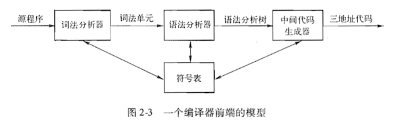

# 引言

在 2.1 小结中，主要有以下内容：
- 介绍了本章的主要内容。
- 编译器分析阶段（前端）和合成阶段（后端）。
- 编译器前端模型的各个组成部分。

## 本章内容

本章的内容是对本书第3章到第6章中介绍的编译技术进行总体介绍。
- 第3章：词法分析
- 第4章：语法分析
- 第5章：语法制导的翻译
- 第6章：中间代码生成

仔细看完第二章的内容，就大致了解以上的章节。
> PS：感觉这本书写得真好，有一种循序渐进的感觉。

## 编译器

**分析阶段**：把源程序划分成各个组成部分，并生成源程序内部的表示形式，这种内部表示称为中间代码。分析阶段是围绕“语法”展开的，语法定义了程序的正确形式。通常会用到“上下文无关文法”和“BNF”来对语法进行描述。

**合成阶段**：合成阶段是围绕“语义”展开的，语义定义了程序的含义（在运行时应该怎么做）。通常会用到“非形式化描述”和“启发性的示例”来对语义进行描述。

## 编译器的前端模型

**词法分析**：使得翻译器可以处理由多个字符组成的构造。

**中间代码**：通常有两种形式，一是抽象语法树，二是三地址码。

---

在附录中，将本章的技术集成在一起，构造出了一个用Java语言编写的编译器前端（作为最后的大作业吧）。