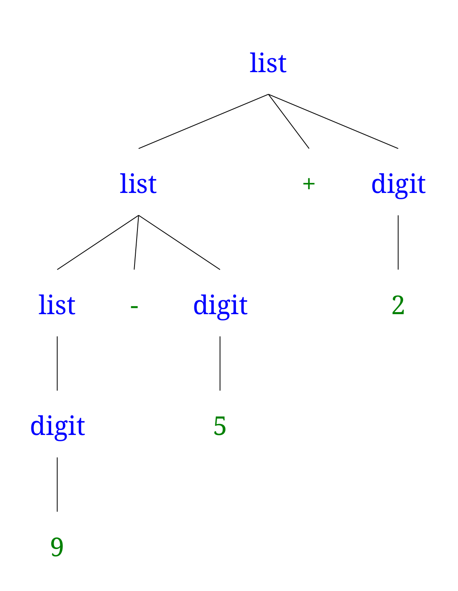

# 语法的定义

在上一节提到了
> 分析阶段是围绕“语法”展开的，语法定义了程序的正确形式。通常会用到“上下文无关文法”和“BNF”来对语法进行描述。

这一节主要是围绕“上下文无关文法”（context-free grammar）来展开，简称“文法”，可以描述编程语言的“语法”。

需要注意的是，“语法”是**层次化**的结构，文法可以自然的描述这种结构。

---

## 文法的四个元素

这个位置如果直接看概念会比较头大，最好结合后面的例2.1来思考。一个上下文无关文法由以下四个元素组成：
- 一个产生式集合。
```
(2.1) list -> list+digit
(2.2) list -> list-digit
(2.3) list -> digit

(2.4) digit -> 0|1|2|3|4|5|6|7|8|9

# 2.1、2.2、2.3 三个式子可以简写为：
list -> list+digit | list-digit | digit
# 如果某个非终结符号是某个产生式的头部，该产生式就是该非终结符号的产生式。
```
- 一个终结符号集合。
```
+ - 0 1 2 3 4 5 6 7 8 9
# 一个终结符符号串是由零个或多个终结符符号组成的序列，零个终结符号组成的串称为空串，记作ε （伊布西龙）。
```
- 一个非终结符号集合。
```
list、digit
```
- 指定一个非终结符号作为开始符号。
```
list
```

> PS：暂时不用细究这个文法是怎么写出来的，毕竟还没有学过，书中第3章才会讲。如果能清楚，我只能Orz。

## 推导的作用

根据文法推导字符号串时，我们首先从开始符号出发，不断将某个非终结符号替换为该非终结符号的某个产生式的体。

前面我们说过，“语法”是**层次化**的结构。通过**推导**这一思想，就可以逐层消除这种层次化的结构，最后判断语法是否正确。

上面的说法比较抽象，现在来尝试 9-5+2 是一个 list（言外之意，证明 9-5+2 符合语法）

1、因为 9 是 digit，根据产生式（2.3）可知 9 是 list。

2、因为 5 是 digit，且 9 是 list，由产生式（2.2）可知 9-5 也是 list。

3、因为 2 是 digit，9-5 是 list，由产生式（2.1）可知 9-5+2 也是 list。

推导的作用就是判断符号串是否当前文法定义的语法。语法分析（parsing）的任务就是根据能否从开始符号推导得到该终结符号串。

当然上述的推导过程过于硬核，后面可以用图形的方式展示推导过程。

## 图形化展示推导过程——语法分析树




一个语法分析树的叶子节点从左到右构成树的结果，也就是说这颗语法分析树的根节点上的非终结符号推导得到符号串。

与语法分析树相关的定义：
- 语言的定义：可以从开始符号推导得到所有终结符号串的集合称为该文法定义的语言。
- 语言的另一个定义：任何能由语法分析树生成的符号串的集合。
- 语法分析的定义：为一个给定的终结符号串构建一棵语法分析树的过程称为对该符号进行语法分析。


## 展示层次化的结构

## 文法描述语法的难点——二义性


