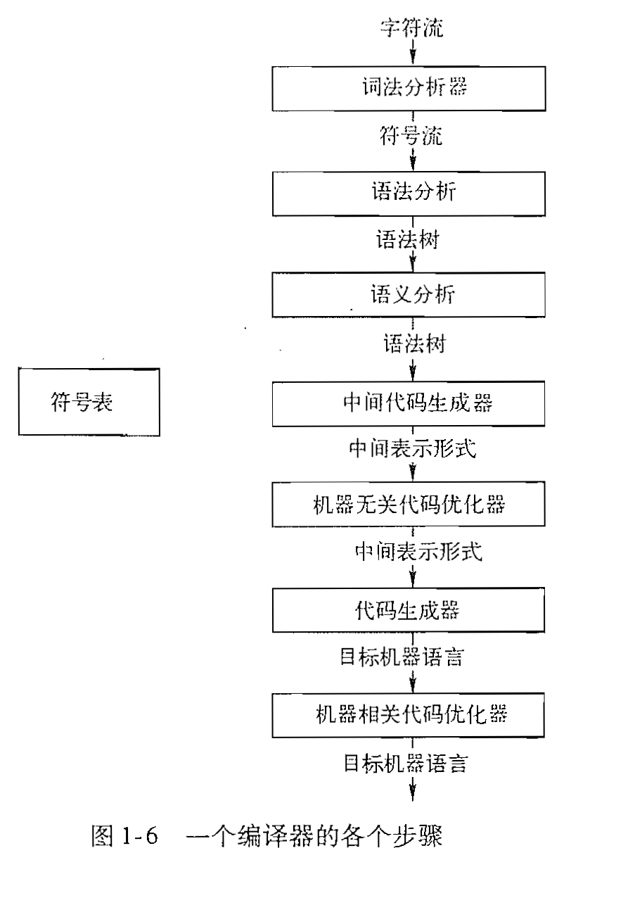

摘录一段书中的话：
> 我们从小事做起，首先建立一个能够将中缀表达式转换成后缀表达式的语法制导器。

在编写语法制导器的之前，以为代码只是简单的读取和转换，甚至还想着大致看懂然后把面向对象改成面向过程。由于给自己设置了时间限制，懵懵懂懂的抄完了代码。

写完之后只能感叹自己写不出来，慢慢精进吧。

---

# 摘录定义

**基础**
- 语法（syntax）：描述了该语言的程序的正确形式。如：上下文无关文法、BNF范式。
- 语义（semantics）：定义了程序的含义，即每个程序再运行时做什么事情。
- 抽象语法树（abstract syntax tree）：简称语法树，是一种源代码语法的表示形式。以树状形式表现编程语言的层次化的语法结构。

**语法定义**
- 上下文无关文法（context-free grammar）：简称CFG，用于描述程序设计语言的表示方法，由四个元素组成（非终结符集合、终结符集合、产生式集合、开始符号）。几乎所有的编程语言都是通过上下文无关文法来定义的。
- 语法制导翻译（syntax-directed translation）：是指一种源代码完全由语法分析器驱动的编译器的实现方法。如：将输入的字符串通过相应的动作上的语法规则的方法翻译为一连串动作（这句话好绕口，Parser.java 就完全印证了这句话）。
- 语法分析（parsing 或 syntactic analysis）：根据某种给定的形式文法对由单词序列（如英语单词序列）构成的输入文本进行分析并确定其语法结构的一种过程。语法分析的主要任务是确定能否可以以及如何从语法的开始符号推导出终结符号串。
- 空串（empty string）：记作ϵ（中文音译：伊普西龙）。
- 语言（language）：可以从开始符号推导得到所有终结符号集合称为该文法定义的语言。
- 二义性（ambiguous）：一个上下文无关文法可能会有多棵语法分析树能够生成同一个给定的终结符号串。
- 语法制导的翻译方案（translation scheme）：翻译方案是一种将程序片段附加到一个文法各个产生式上的表示方法（在本章多次使用）。
- 属性：表示与某个程序构造相关的任意的量。（类似语法制导定义，但包含了树的遍历方法、并不会计算值，只是转换形式）
- 语法制导定义（syntax directed definition）：把每个文法符号和属性相关联，并且把每个产生式和一组语义规则相关联，这些规则用于计算该产生式中相关联属性值。（类似语义）
- 简单语法制导定义：要得到代表产生式头部的非终结符号的翻译结果的字符串，只需要将产生式中各非终结符符号的翻译结果按照它们在非终结符号中的出现顺序连接起来，并在其中穿插一些附加的串即可。
- 自顶向下分析法：是一种语法分析方法，主要指语法分析树的构造顺序。在自顶向下的语法分析器中，构造过程从叶子节点开始，逐步构建出根节点。常用于语法分析器。
- 自底向上分析法：构造过程从叶子节点开始，逐步构造出根节点。常用于从文法生成语法分析器的软件工具。
- 预测分析法（递归下降方法 Recursive descent parsing）：是一种自顶向下的语法分析方法，这种方法在构建语法树的时候不用回溯，是一种优秀的算法。

**词法分析**

- 词素（lexem）：构造一个词法单元的输入字符序列称为词素。
- 关键词：大多数编程语言使用 for、do、if 这样的固定字符串作为标点符号，或者用于表示某种符号。

**符号表**

- 符号表（symbol table）：一种供编译器用于保存有关源程序构造的各种信息的数据结构。
- 最近嵌套规则（most-closely）：一个标识符 x 在最近的 x 声明的作用域中。也就是说，从x出现的快开始，从内而外检查各个快时找到的第一个对x的声明。

**生成中间代码**

- 中间表示形式：最重要的两种中间表示形式——树形结构、线性表示形式。
- 三地址代码：一个由基本程序步骤（比如两个值相加）组成的序列。
- 静态检查（Static Check）：检查源程序是否遵循源语言的语法和语义规则（类型检查）。“静态”一般是指编译器完成。静态检查确保特定类型的程序错误，包括类型不匹配，能在编译过程中被检测并报告。
- 自动类型转换（coercion）：当一个运算分量的类型被自动转换为运算符所期望的类型时，就发生了自动类型转换。
- 重载（overloading）：如果一个符号在不同上下文中有不同的含义，我们就说这个符号时重载的。

# 类比简化

首先需要了解编译器的各个步骤

然后在逐个步骤的理解前面的概念。

---

**词法分析**主要是将输入的文本（9-5+2）变成一个个的小方块（<9><-><5><+><2>），而不是散乱的文本，后面的语义分析只能识别这些小方块。
- Lexer.java
> PS：这里的小方块是指终止符、非终止符。小方块叫做词素。

**语法分析**主要是重新组合（生成语法树或者其他结构）来对前面的方块，进而判断是否符合语法规则。在重新组合时，通常会使用递归下降方法（自顶向下方法的一种）。虽然文中频繁提到抽象语法树，但是在代码中却没有体现，可能主要是为了让我们更好理解吧。在语法分析阶段还会生成符号表。
- Parsing.java
- Env.java

语义分析和中间代码都讲得比较浅，暂时只作为了解。

